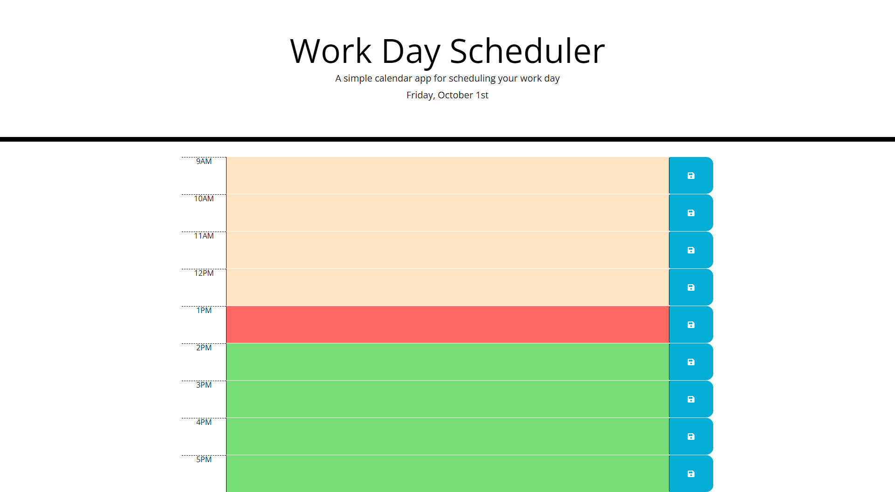

# Homework-4-Working Calander
  The objective of this project was to create a timed javascript code quiz that subtracts 10 seconds from the timer every time you answer a question incorreclty. The final score should then be saved and placed into a highscore list that can be viewed on the highscore page. 
  
##What was done in the homework--3
  Within the homework, I created a series of questions and choices that appear on the screen with a timer in the top right corner. For every question incorrectly answered, you would lose 10 seconds from timer. Once the final question was answered, the score is given and the user will be given the option to save their scores into the highscore list. 
  
## ## Project Live Website
  The coding quiz can be found [here](https://kalvinn361.github.io/JavaScript-Code-Quiz/)

